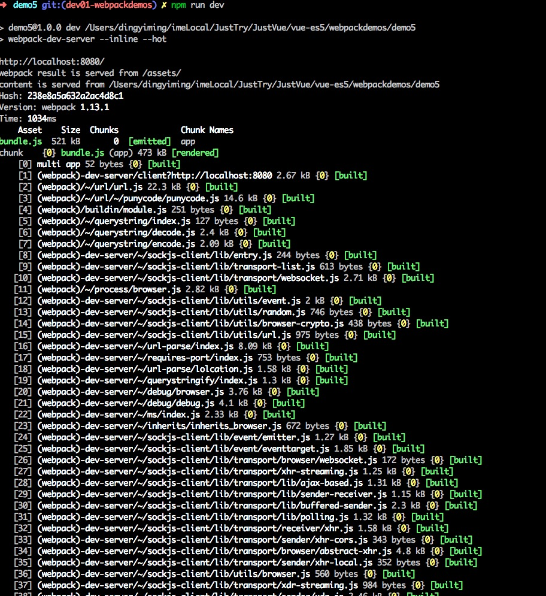
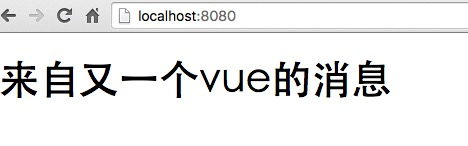
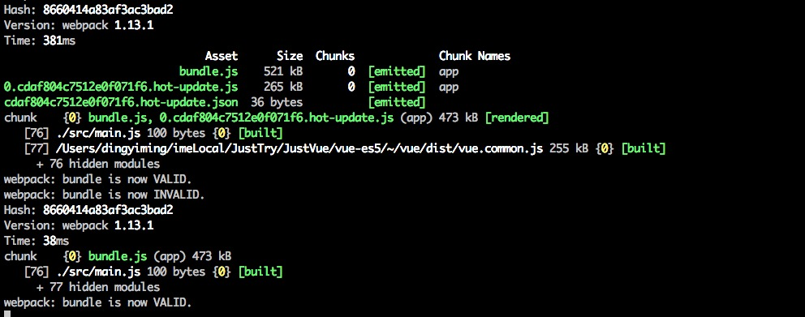
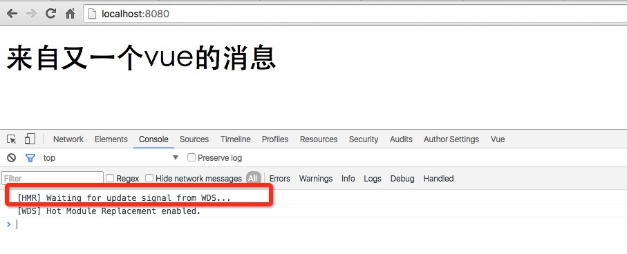
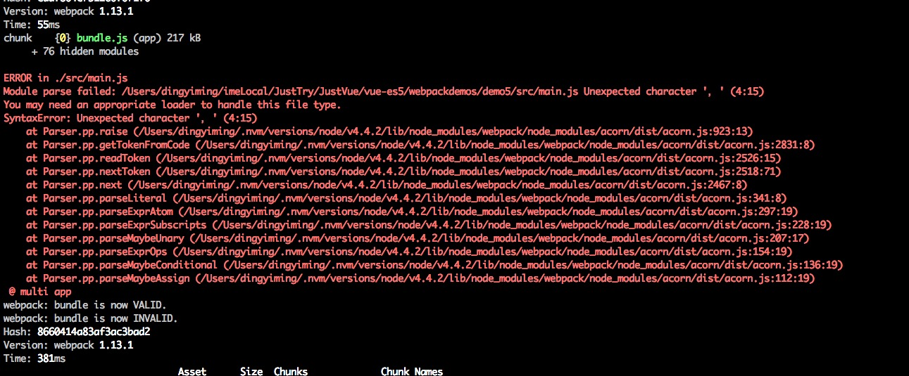
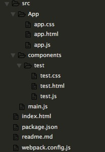

## demo5 vue and webpack-dev-server

* ✅ 目标1: 实现webpack-dev-server HMR 热加载 
* ✅ 目标2: 加入css-loader进行css模块加载 
* ✅ 目标3: JS模块加载，webpack自带 就用`module.exports / require() `就可以了（ES5下）‘,真正模块化还是靠命名，或者BEM或者CSS Modules
* ✅ 目标4: HTML模块加载,引入到vuejs中使用    
* ✅ 目标5: 将index.html中的标签移入test组件中去，注意不要再组件中带自己的标签
* ✅ 目标6: 添加了根组件App

## 查阅资料

* https://www.zfanw.com/blog/webpack-tutorial.html
* https://github.com/jackyon/Webpack-Chinese-Translation/blob/master/api/webpack-dev-server/README.md
* https://github.com/alexanderGugel/ied

## 一些图

